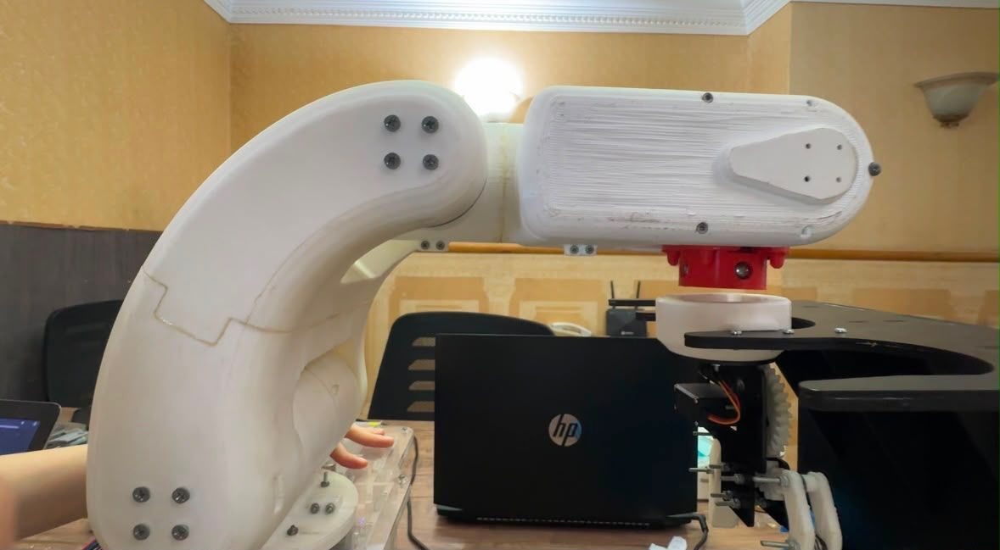
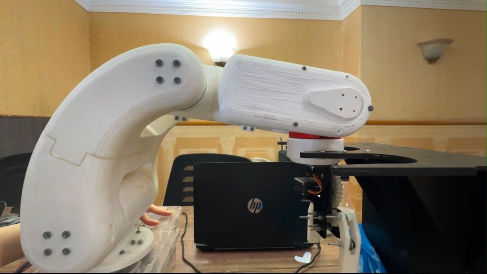
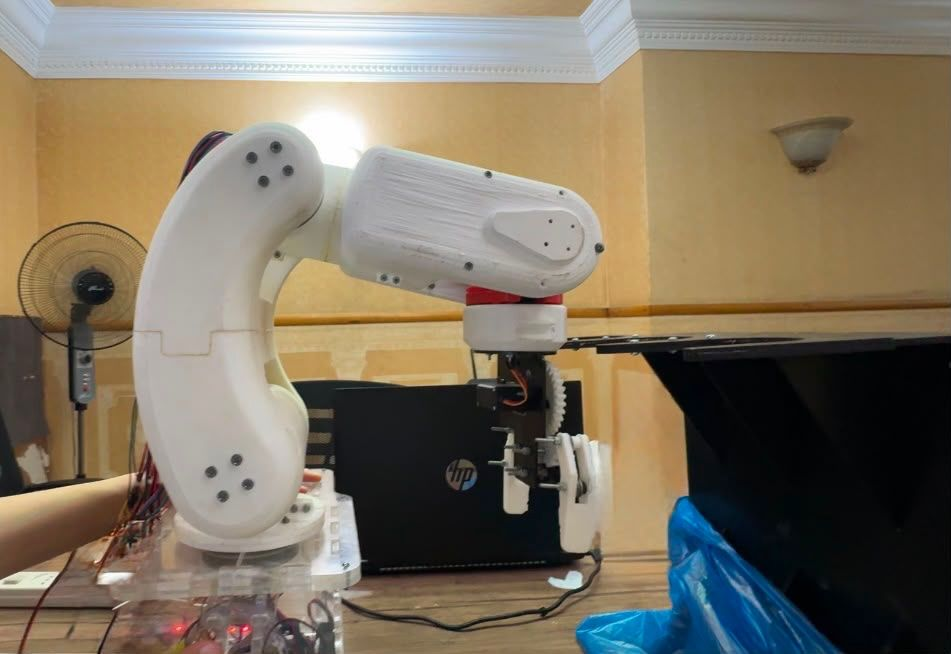

# ATCRA - Automatic Tool-Changing Robotic Arm

<div align="center">

**An autonomous ROS 2-based robotic manipulation system with automatic tool changing, computer vision, and motion planning.**

🏆 **1st Place Winner – ICMISI 2026 Graduation Projects Competition**

</div>

---

## Overview

ATCRA (Automatic Tool-Changing Robotic Arm) is a graduation project developed to improve flexibility, efficiency, and cost-effectiveness in automated manufacturing systems.

Unlike conventional robotic workstations that require multiple dedicated manipulators, ATCRA enables a single robotic arm to automatically exchange end-effectors, allowing it to perform multiple manufacturing tasks using one robotic platform.

The project integrates robotics, embedded systems, motion planning, computer vision, and custom hardware into one complete autonomous solution.

---
## 🎥 Project Demonstration

📹 **Watch the full demonstration here:**

https://drive.google.com/file/d/1jRISlPLguDfTuXDAfmcVbNdn96eW5K7E/view?usp=sharing


## Project Gallery

   <p align="center">
   
   
   </p>

   <p align="center">
   
   
   </p>
## Features

- 🔄 Automatic tool-changing mechanism
- 🤖 ROS 2 Humble software architecture
- 💻 Simulation and real hardware support
- ⚙️ Custom hardware interface with `ros2_control`
- 👁️ Vision-guided object detection
- 📍 Vision-based coordinate extraction
- 🦾 Autonomous pick-and-place

- 🎯 Motion planning using MoveIt 2
   <p align="center">
  
   </p>
   
- 🛠️ Custom robotic arm design
   <p align="center">
  
  
   </p>

---

# Repository Structure

```
ATCRA/
│
├── sabry/                 # Robot description package
├── sabry_hardware/        # Hardware interface and tool changer
├── sabry_moveit/          # MoveIt configuration for simulation
├── sabrydemo_moveit/      # MoveIt configuration for real hardware
├── README.md
└── LICENSE
```

---

# Package Overview

## 📦 sabry

The robot description package.

Contains:

- URDF/Xacro files
- Robot meshes
- Configuration files
- Robot kinematic description

This package serves as the common robot description used by both simulation and hardware environments.

---

## 📦 sabry_hardware

Responsible for communication with the physical robotic arm.

Features include:

- Automatic tool-changing logic
- `ros2_control` hardware interface
- Custom ROS 2 actions
- Custom ROS 2 services
- Communication with motor controllers
- Hardware-level robot control

---

## 📦 sabry_moveit

MoveIt 2 configuration package used for simulation.

Allows testing of:

- Motion planning
- Trajectory execution
- Tool-changing pipeline

Since no camera is used during simulation, workpiece coordinates are published manually.

---

## 📦 sabrydemo_moveit

MoveIt 2 configuration package for the physical robotic arm.

This package connects MoveIt directly with the hardware interface, allowing execution on the real robot.

---

# Prerequisites

Before running the project, install:

- Ubuntu 22.04
- ROS 2 Humble
- MoveIt 2
- ros2_control
- Colcon

---

# Installation

Clone the repository into your ROS 2 workspace.

```bash
cd ~/ros2_ws/src
git clone https://github.com/<YOUR_USERNAME>/ATCRA.git
```

Build the workspace.

```bash
cd ..
colcon build
```

Source the workspace.

```bash
source install/setup.bash
```

---

# Running on Real Hardware

### 1. Launch MoveIt

```bash
ros2 launch sabrydemo_moveit demo.launch.py
```

### 2. Launch the robot bring-up

```bash
ros2 launch sabry_bringup sabry_bringup.launch.xml
```

### 3. Start the vision node

```bash
ros2 run sabry_hardware inspection_v3.py
```

The vision node performs:

- Object detection
- Coordinate estimation
- Publishing workpiece coordinates for autonomous pick-and-place.

---

# Running in Simulation

Launch MoveIt.

```bash
ros2 launch sabry_moveit demo.launch.py
```

Launch the bring-up package.

```bash
ros2 launch sabry_bringup sabry_bringup.launch.xml
```

Publish workpiece coordinates manually.

```bash
ros2 topic pub /workpiece_coordinates geometry_msgs/msg/Point \
"{x: 0.1, y: 0.1, z: 0.35}" --once
```

---

# Package Summary

| Package | Description |
|----------|-------------|
| `sabry` | Robot description (URDF, Xacro, meshes, configuration) |
| `sabry_hardware` | Hardware interface, tool changer, ROS 2 services/actions |
| `sabry_moveit` | Simulation environment |
| `sabrydemo_moveit` | Real hardware environment |

---

# Software Stack

- ROS 2 Humble
- MoveIt 2
- C++
- Python
- ros2_control
- RViz2
- Ubuntu 22.04

---

# Workflow

```text
Camera
   │
   ▼
Object Detection
   │
   ▼
Coordinate Extraction
   │
   ▼
Motion Planning (MoveIt 2)
   │
   ▼
Trajectory Execution
   │
   ▼
Automatic Tool Change
   │
   ▼
Pick-and-Place Operation
```

---

# Future Improvements

- Automatic tool calibration
- Force/Torque sensing
- AI-based grasp planning
- Industrial communication protocols
- Multi-camera perception

---

# Team

Developed as a graduation project by the **ATCRA Team**.

---

# License

This project is intended for educational and research purposes.

Feel free to fork, improve, and contribute.